# Especificación Técnica Universal - Grupo Fotográfico Centro

## 📑 Índice
1. [Descripción General](#-descripción-general)
2. [Objetivo](#-objetivo)
3. [Resumen Ejecutivo](#-resumen-ejecutivo)
4. [Arquitectura de Alto Nivel](#️-arquitectura-de-alto-nivel)
5. [Especificación de Diseño Visual](#-especificación-de-diseño-visual)
6. [Especificación Funcional](#-especificación-funcional)
7. [Especificación de Datos](#-especificación-de-datos)
8. [Flujos de Proceso](#-flujos-de-proceso)
9. [Especificación de APIs](#-especificación-de-apis)
10. [Especificación de Testing](#-especificación-de-testing)
11. [Especificación de Despliegue](#-especificación-de-despliegue)
12. [Especificación de Seguridad](#-especificación-de-seguridad)
13. [Especificación de Internacionalización](#-especificación-de-internacionalización)
14. [Especificación de Accesibilidad](#-especificación-de-accesibilidad)
15. [Especificación de Monitoreo y Observabilidad](#-especificación-de-monitoreo-y-observabilidad)
16. [Especificación de Integración](#-especificación-de-integración)
17. [Especificación de Dispositivos Móviles](#-especificación-de-dispositivos-móviles)
18. [Especificación de Configuración](#-especificación-de-configuración)
19. [Checklist de Implementación](#-checklist-de-implementación)
20. [Migración y Compatibilidad](#-migración-y-compatibilidad)
21. [Métricas y KPIs](#-métricas-y-kpis)

## 📋 Descripción General

Esta especificación técnica universal define completamente el comportamiento, funcionalidad y estética del sistema del Grupo Fotográfico Centro de manera independiente de la tecnología de implementación. Permite replicar el sistema en cualquier stack tecnológico.

## 🎯 Objetivo

Crear una abstracción completa que capture:
- **Funcionalidad**: Todas las características del sistema
- **Comportamiento**: Flujos de usuario y lógica de negocio
- **Estética**: Diseño visual y experiencia de usuario
- **Arquitectura**: Estructura y patrones de diseño
- **Datos**: Modelos y relaciones

## 📊 Resumen Ejecutivo

### Visión General
El sistema del Grupo Fotográfico Centro es una plataforma integral para la gestión de concursos fotográficos que permite a organizaciones crear, administrar y participar en concursos de manera eficiente y transparente.

### Funcionalidades Principales
- **Gestión de Concursos**: Creación, administración y participación en concursos fotográficos
- **Sistema de Usuarios**: Registro, autenticación y gestión de perfiles con roles diferenciados
- **Gestión de Imágenes**: Subida, almacenamiento y organización de fotografías
- **Sistema de Juzgamiento**: Evaluación y puntuación de fotografías por jueces
- **Rankings y Resultados**: Cálculo automático de resultados y generación de rankings
- **Gestión de Organizaciones**: Administración de fotoclubes y organizaciones participantes

### Arquitectura Clave
- **Arquitectura en Capas**: Separación clara de responsabilidades
- **APIs RESTful**: Interfaz de programación estandarizada
- **Base de Datos Relacional**: Modelo de datos normalizado
- **Sistema de Autenticación**: JWT y gestión de sesiones segura
- **Almacenamiento de Archivos**: Gestión eficiente de imágenes

### Tecnologías Compatibles
- **Frontend**: Angular, React, Vue.js, o cualquier framework moderno
- **Backend**: Node.js, Python, Java, .NET, PHP, o cualquier lenguaje
- **Base de Datos**: PostgreSQL, MySQL, SQL Server, o cualquier RDBMS
- **Almacenamiento**: AWS S3, Azure Blob, Google Cloud Storage, o local
- **Cache**: Redis, Memcached, o almacenamiento en memoria

### Métricas de Calidad
- **Performance**: Tiempo de respuesta < 500ms para APIs
- **Disponibilidad**: Uptime > 99.9%
- **Seguridad**: Cumplimiento con estándares OWASP
- **Accesibilidad**: Conformidad WCAG 2.1 AA
- **Testing**: Cobertura mínima del 80%

### Fases de Implementación
1. **Fase 1**: Base del sistema (autenticación, usuarios, base de datos)
2. **Fase 2**: Funcionalidades core (concursos, imágenes, organizaciones)
3. **Fase 3**: Funcionalidades avanzadas (juzgamiento, rankings, notificaciones)
4. **Fase 4**: Optimización (performance, testing, documentación)

## 🏗️ Arquitectura de Alto Nivel

### Patrón de Arquitectura Universal
```
┌─────────────────────────────────────┐
│           PRESENTACIÓN              │
│  (UI Components / Views / Pages)    │
├─────────────────────────────────────┤
│           LÓGICA DE NEGOCIO         │
│        (Business Logic Layer)       │
├─────────────────────────────────────┤
│           ACCESO A DATOS            │
│        (Data Access Layer)          │
├─────────────────────────────────────┤
│           PERSISTENCIA              │
│        (Database / Storage)         │
└─────────────────────────────────────┘
```

### Principios de Diseño
1. **Separación de Responsabilidades**: Cada capa tiene responsabilidades específicas
2. **Inversión de Dependencias**: Las capas superiores no dependen de las inferiores
3. **Interfaces Abstraídas**: Contratos claros entre capas
4. **Configuración Externa**: Configuración independiente del código
5. **Testing Independiente**: Cada capa puede ser testeada aisladamente

## 🎨 Especificación de Diseño Visual

### Sistema de Diseño

#### Paleta de Colores
```css
/* Colores Primarios */
--primary-color: #3880ff;        /* Azul principal */
--primary-dark: #2c5aa0;         /* Azul oscuro */
--primary-light: #5c9dff;        /* Azul claro */

/* Colores Secundarios */
--secondary-color: #3dc2ff;      /* Azul claro secundario */
--tertiary-color: #5260ff;       /* Azul violeta */

/* Colores de Estado */
--success-color: #2dd36f;        /* Verde éxito */
--warning-color: #ffc409;        /* Amarillo advertencia */
--danger-color: #eb445a;         /* Rojo error */
--info-color: #3880ff;           /* Azul información */

/* Colores Neutros */
--light-color: #f8f9fa;          /* Gris muy claro */
--medium-color: #92949c;         /* Gris medio */
--dark-color: #222428;           /* Gris oscuro */
--white: #ffffff;                /* Blanco */
--black: #000000;                /* Negro */
```

#### Tipografía
```css
/* Familia de Fuentes */
--font-family-primary: 'Roboto', -apple-system, BlinkMacSystemFont, 'Segoe UI', sans-serif;
--font-family-secondary: 'Helvetica Neue', Arial, sans-serif;

/* Tamaños de Fuente */
--font-size-xs: 0.75rem;         /* 12px */
--font-size-sm: 0.875rem;        /* 14px */
--font-size-base: 1rem;          /* 16px */
--font-size-lg: 1.125rem;        /* 18px */
--font-size-xl: 1.25rem;         /* 20px */
--font-size-2xl: 1.5rem;         /* 24px */
--font-size-3xl: 1.875rem;       /* 30px */
--font-size-4xl: 2.25rem;        /* 36px */

/* Pesos de Fuente */
--font-weight-light: 300;
--font-weight-normal: 400;
--font-weight-medium: 500;
--font-weight-semibold: 600;
--font-weight-bold: 700;
```

#### Espaciado
```css
/* Sistema de Espaciado */
--spacing-xs: 0.25rem;           /* 4px */
--spacing-sm: 0.5rem;            /* 8px */
--spacing-md: 1rem;              /* 16px */
--spacing-lg: 1.5rem;            /* 24px */
--spacing-xl: 2rem;              /* 32px */
--spacing-2xl: 3rem;             /* 48px */
--spacing-3xl: 4rem;             /* 64px */

/* Márgenes y Padding */
--container-padding: var(--spacing-md);
--section-margin: var(--spacing-xl);
--card-padding: var(--spacing-lg);
```

#### Bordes y Sombras
```css
/* Bordes */
--border-radius-sm: 0.25rem;     /* 4px */
--border-radius-md: 0.5rem;      /* 8px */
--border-radius-lg: 1rem;        /* 16px */
--border-radius-xl: 1.5rem;      /* 24px */
--border-radius-full: 9999px;    /* Circular */

--border-width: 1px;
--border-color: var(--medium-color);

/* Sombras */
--shadow-sm: 0 1px 2px 0 rgba(0, 0, 0, 0.05);
--shadow-md: 0 4px 6px -1px rgba(0, 0, 0, 0.1);
--shadow-lg: 0 10px 15px -3px rgba(0, 0, 0, 0.1);
--shadow-xl: 0 20px 25px -5px rgba(0, 0, 0, 0.1);
```

### Componentes de Diseño

#### Botones
```css
/* Botón Primario */
.btn-primary {
  background-color: var(--primary-color);
  color: var(--white);
  border: none;
  border-radius: var(--border-radius-md);
  padding: var(--spacing-sm) var(--spacing-md);
  font-weight: var(--font-weight-medium);
  cursor: pointer;
  transition: all 0.2s ease;
}

.btn-primary:hover {
  background-color: var(--primary-dark);
  transform: translateY(-1px);
  box-shadow: var(--shadow-md);
}

/* Botón Secundario */
.btn-secondary {
  background-color: transparent;
  color: var(--primary-color);
  border: 1px solid var(--primary-color);
  border-radius: var(--border-radius-md);
  padding: var(--spacing-sm) var(--spacing-md);
  font-weight: var(--font-weight-medium);
  cursor: pointer;
  transition: all 0.2s ease;
}

.btn-secondary:hover {
  background-color: var(--primary-color);
  color: var(--white);
}
```

#### Tarjetas
```css
.card {
  background-color: var(--white);
  border-radius: var(--border-radius-lg);
  box-shadow: var(--shadow-md);
  padding: var(--card-padding);
  margin-bottom: var(--spacing-md);
  transition: all 0.2s ease;
}

.card:hover {
  box-shadow: var(--shadow-lg);
  transform: translateY(-2px);
}

.card-header {
  border-bottom: 1px solid var(--border-color);
  padding-bottom: var(--spacing-md);
  margin-bottom: var(--spacing-md);
}

.card-title {
  font-size: var(--font-size-lg);
  font-weight: var(--font-weight-semibold);
  color: var(--dark-color);
  margin: 0;
}
```

#### Formularios
```css
.form-group {
  margin-bottom: var(--spacing-md);
}

.form-label {
  display: block;
  font-weight: var(--font-weight-medium);
  color: var(--dark-color);
  margin-bottom: var(--spacing-xs);
}

.form-input {
  width: 100%;
  padding: var(--spacing-sm);
  border: 1px solid var(--border-color);
  border-radius: var(--border-radius-md);
  font-size: var(--font-size-base);
  transition: border-color 0.2s ease;
}

.form-input:focus {
  outline: none;
  border-color: var(--primary-color);
  box-shadow: 0 0 0 3px rgba(56, 128, 255, 0.1);
}

.form-error {
  color: var(--danger-color);
  font-size: var(--font-size-sm);
  margin-top: var(--spacing-xs);
}
```

### Responsive Design

#### Breakpoints
```css
/* Mobile First Approach */
/* Extra Small (xs) */
@media (min-width: 0px) {
  .container { max-width: 100%; }
}

/* Small (sm) */
@media (min-width: 576px) {
  .container { max-width: 540px; }
}

/* Medium (md) */
@media (min-width: 768px) {
  .container { max-width: 720px; }
}

/* Large (lg) */
@media (min-width: 992px) {
  .container { max-width: 960px; }
}

/* Extra Large (xl) */
@media (min-width: 1200px) {
  .container { max-width: 1140px; }
}

/* Extra Extra Large (xxl) */
@media (min-width: 1400px) {
  .container { max-width: 1320px; }
}
```

#### Grid System
```css
.grid {
  display: grid;
  gap: var(--spacing-md);
}

.grid-1 { grid-template-columns: repeat(1, 1fr); }
.grid-2 { grid-template-columns: repeat(2, 1fr); }
.grid-3 { grid-template-columns: repeat(3, 1fr); }
.grid-4 { grid-template-columns: repeat(4, 1fr); }

@media (max-width: 768px) {
  .grid-2, .grid-3, .grid-4 {
    grid-template-columns: 1fr;
  }
}
```

## 🔧 Especificación Funcional

### Módulos del Sistema

#### 1. Módulo de Autenticación
**Funcionalidades**:
- Login de usuarios
- Registro de nuevos usuarios
- Recuperación de contraseña
- Gestión de sesiones
- Control de acceso basado en roles

**Flujos de Usuario**:
```
1. Usuario accede a /login
2. Ingresa credenciales (username/email + password)
3. Sistema valida credenciales
4. Si válidas: redirige a dashboard
5. Si inválidas: muestra error
6. Opción "Recordar sesión" disponible
```

**Estados de Autenticación**:
- `authenticated`: Usuario logueado
- `unauthenticated`: Usuario no logueado
- `expired`: Sesión expirada
- `loading`: Verificando autenticación

#### 2. Módulo de Concursos
**Funcionalidades**:
- Listado de concursos
- Creación de concursos (admin)
- Edición de concursos (admin)
- Visualización de detalle de concurso
- Inscripción de participantes
- Gestión de fotografías
- Sistema de juzgamiento
- Rankings y resultados

**Estados de Concurso**:
- `draft`: Borrador
- `active`: Activo y abierto
- `closed`: Cerrado para inscripciones
- `judged`: Juzgado
- `archived`: Archivado

**Flujo de Participación**:
```
1. Usuario navega a lista de concursos
2. Selecciona concurso activo
3. Revisa información y reglas
4. Se inscribe seleccionando secciones
5. Sube fotografías según límites
6. Espera juzgamiento
7. Revisa resultados y ranking
```

#### 3. Módulo de Usuarios
**Funcionalidades**:
- Gestión de perfiles
- Administración de usuarios (admin)
- Cambio de contraseña
- Edición de información personal
- Gestión de roles y permisos

**Tipos de Usuario**:
- `admin`: Administrador del sistema
- `user`: Usuario regular
- `judge`: Juez de concursos

**Permisos por Rol**:
```yaml
admin:
  - gestionar_usuarios
  - crear_concursos
  - gestionar_concursos
  - ver_todas_fotografias
  - gestionar_organizaciones
  - ver_estadisticas

judge:
  - juzgar_concursos
  - ver_fotografias_concurso
  - asignar_puntuaciones
  - ver_resultados

user:
  - inscribirse_concursos
  - subir_fotografias
  - ver_propio_perfil
  - editar_propio_perfil
```

#### 4. Módulo de Organizaciones
**Funcionalidades**:
- Listado de organizaciones
- Información detallada de cada organización
- Gestión de organizaciones (admin)
- Estadísticas por organización

**Información de Organización**:
- Nombre y descripción
- Información de contacto
- Redes sociales
- Logo/imagen
- Miembros
- Historial de participación

#### 5. Módulo de Contenido
**Funcionalidades**:
- Página principal con información del centro
- Gestión de contenido informativo
- Presentación de comisión directiva
- Información de miembros
- Presentación del último concurso

### Interacciones de Usuario

#### Patrones de Navegación
```yaml
Navegación Principal:
  - Home: Página principal
  - Concursos: Lista de concursos
  - Mi Perfil: Perfil del usuario
  - Organizaciones: Lista de organizaciones
  - Notificaciones: Centro de notificaciones

Navegación Secundaria:
  - Breadcrumbs: Ruta actual
  - Tabs: Navegación por secciones
  - Paginación: Navegación por páginas
  - Filtros: Búsqueda y filtrado
```

#### Estados de Carga
```yaml
Estados de UI:
  - loading: Mostrar spinner/indicador
  - success: Mostrar mensaje de éxito
  - error: Mostrar mensaje de error
  - empty: Mostrar estado vacío
  - disabled: Deshabilitar interacciones
```

#### Feedback de Usuario
```yaml
Tipos de Feedback:
  - Toast notifications: Mensajes temporales
  - Alert dialogs: Confirmaciones importantes
  - Progress indicators: Progreso de operaciones
  - Validation messages: Errores de validación
  - Success confirmations: Confirmaciones de éxito
```

## 📊 Especificación de Datos

### Modelo de Datos Universal

#### Entidades Principales
```yaml
User:
  id: unique_identifier
  username: string
  email: string
  password_hash: string
  role_id: foreign_key
  profile_id: foreign_key
  created_at: timestamp
  updated_at: timestamp

Profile:
  id: unique_identifier
  name: string
  last_name: string
  fotoclub_id: foreign_key
  img_url: string
  executive: boolean
  executive_rol: string
  dni: string
  created_at: timestamp
  updated_at: timestamp

Contest:
  id: unique_identifier
  name: string
  description: text
  start_date: date
  end_date: date
  max_img_section: integer
  img_url: string
  rules_url: string
  active: boolean
  judged: boolean
  created_at: timestamp
  updated_at: timestamp

Image:
  id: unique_identifier
  code: string
  title: string
  profile_id: foreign_key
  contest_id: foreign_key
  section_id: foreign_key
  url: string
  description: text
  technical_data: text
  created_at: timestamp
  updated_at: timestamp

Fotoclub:
  id: unique_identifier
  name: string
  description: text
  facebook: string
  instagram: string
  email: string
  photo_url: string
  website: string
  phone: string
  address: string
  city: string
  country: string
  created_at: timestamp
  updated_at: timestamp
```

#### Relaciones
```yaml
Relaciones:
  User -> Profile: one_to_one
  User -> Role: many_to_one
  Profile -> Fotoclub: many_to_one
  Contest -> ContestSection: one_to_many
  Contest -> ContestCategory: one_to_many
  Contest -> ProfileContest: one_to_many
  Contest -> Image: one_to_many
  Contest -> ContestResult: one_to_many
  Image -> Profile: many_to_one
  Image -> Section: many_to_one
  Image -> ContestResult: one_to_many
  Section -> ContestSection: one_to_many
  Category -> ContestCategory: one_to_many
```

### Reglas de Negocio

#### Validaciones
```yaml
User:
  username:
    required: true
    min_length: 3
    max_length: 50
    pattern: "^[a-zA-Z0-9_]+$"
    unique: true
  
  email:
    required: true
    format: email
    unique: true
  
  password:
    required: true
    min_length: 8
    pattern: "^(?=.*[a-z])(?=.*[A-Z])(?=.*\\d)[a-zA-Z\\d@$!%*?&]"

Contest:
  name:
    required: true
    min_length: 5
    max_length: 100
  
  start_date:
    required: true
    format: date
    future_date: true
  
  end_date:
    required: true
    format: date
    after: start_date
  
  max_img_section:
    required: true
    min_value: 1
    max_value: 10

Image:
  title:
    required: true
    min_length: 1
    max_length: 100
  
  file:
    required: true
    max_size: "10MB"
    allowed_types: ["image/jpeg", "image/png", "image/gif"]
```

#### Reglas de Negocio
```yaml
Concursos:
  - Un usuario solo puede inscribirse una vez por concurso
  - Un usuario puede subir máximo X imágenes por sección
  - Solo concursos activos permiten inscripciones
  - Solo concursos cerrados permiten juzgamiento
  - Un juez no puede juzgar sus propias imágenes

Fotografías:
  - Solo el autor puede eliminar sus fotografías
  - Las fotografías no pueden modificarse después del cierre del concurso
  - Cada fotografía debe tener un código único
  - Las fotografías deben cumplir con las reglas del concurso

Usuarios:
  - Un usuario no puede cambiar su propio rol
  - Solo administradores pueden gestionar usuarios
  - Un usuario no puede eliminar su propia cuenta
  - Los cambios de contraseña requieren confirmación
```

## 🔄 Flujos de Proceso

### Flujo de Creación de Concurso

```mermaid
graph TD
    A[Admin inicia creación] --> B[Completa información básica]
    B --> C[Define secciones y categorías]
    C --> D[Establece fechas y límites]
    D --> E[Sube imagen y reglas]
    E --> F[Activa el concurso]
    F --> G[Notifica a usuarios]
    G --> H[Concurso disponible]
```


### Flujo de Participación

```mermaid
graph TD
    A[Usuario ve concurso] --> B[Revisa información]
    B --> C[Se inscribe]
    C --> D[Selecciona secciones]
    D --> E[Sube fotografías]
    E --> F[Espera juzgamiento]
    F --> G[Revisa resultados]
    G --> H[Recibe certificado]
```


### Flujo de Juzgamiento

```mermaid
graph TD
    A[Juez accede al concurso] --> B[Ve fotografías asignadas]
    B --> C[Evalúa cada fotografía]
    C --> D[Asigna puntuación]
    D --> E[Agrega comentarios]
    E --> F[Confirma evaluación]
    F --> G[Sistema calcula resultados]
    G --> H[Publica ranking]
```


## 🎯 Especificación de APIs

### Endpoints Universales

#### Autenticación
```yaml
POST /api/auth/login:
  description: Iniciar sesión
  request:
    username: string
    password: string
  response:
    success: boolean
    token: string
    user: UserLogged
    expires_at: string

POST /api/auth/logout:
  description: Cerrar sesión
  response:
    success: boolean

POST /api/auth/register:
  description: Registrar nuevo usuario
  request:
    username: string
    email: string
    password: string
    profile: ProfileData
  response:
    success: boolean
    user: User
```

#### Concursos
```yaml
GET /api/contests:
  description: Listar concursos
  query_params:
    status: string
    page: integer
    limit: integer
  response:
    data: Contest[]
    meta: PaginationMeta

GET /api/contests/{id}:
  description: Obtener concurso específico
  response:
    data: ContestExpanded

POST /api/contests:
  description: Crear concurso
  request:
    name: string
    description: string
    start_date: date
    end_date: date
    max_img_section: integer
  response:
    data: Contest

PUT /api/contests/{id}:
  description: Actualizar concurso
  request: ContestData
  response:
    data: Contest
```

#### Imágenes
```yaml
POST /api/images:
  description: Subir imagen
  request:
    title: string
    description: string
    section_id: integer
    contest_id: integer
    file: File
  response:
    data: Image

GET /api/contests/{id}/images:
  description: Obtener imágenes de concurso
  query_params:
    section_id: integer
    profile_id: integer
  response:
    data: Image[]
```

### Respuestas Estándar
```yaml
Success Response:
  success: true
  data: any
  message: string
  meta: object

Error Response:
  success: false
  error: string
  errors: string[]
  code: string
```

## 🧪 Especificación de Testing

### Casos de Prueba Universales

#### Autenticación
```yaml
Login Tests:
  - Login exitoso con credenciales válidas
  - Login fallido con credenciales inválidas
  - Login con usuario inexistente
  - Login con contraseña incorrecta
  - Login con campos vacíos
  - Login con formato de email inválido
  - Logout exitoso
  - Verificación de token expirado

Registration Tests:
  - Registro exitoso con datos válidos
  - Registro fallido con username duplicado
  - Registro fallido con email duplicado
  - Registro fallido con contraseña débil
  - Registro fallido con campos requeridos faltantes
```

#### Concursos
```yaml
Contest Management Tests:
  - Crear concurso exitoso
  - Crear concurso con fechas inválidas
  - Editar concurso existente
  - Eliminar concurso
  - Listar concursos con filtros
  - Ver detalle de concurso
  - Inscribirse a concurso
  - Inscripción duplicada
  - Inscripción a concurso cerrado

Image Upload Tests:
  - Subir imagen exitosa
  - Subir imagen con formato inválido
  - Subir imagen excediendo límite de tamaño
  - Subir imagen sin título
  - Subir imagen a sección inexistente
  - Eliminar imagen propia
  - Eliminar imagen ajena (debe fallar)
```

#### Usuarios
```yaml
User Management Tests:
  - Crear usuario exitoso
  - Editar perfil propio
  - Editar perfil ajeno (solo admin)
  - Cambiar contraseña
  - Cambiar contraseña con actual incorrecta
  - Verificar permisos por rol
  - Acceso denegado a funcionalidades restringidas
```

### Cobertura de Testing
```yaml
Cobertura Mínima:
  - Unit Tests: 80%
  - Integration Tests: 70%
  - E2E Tests: 60%
  - API Tests: 90%

Tipos de Testing:
  - Unit: Funciones y métodos individuales
  - Integration: Interacción entre componentes
  - E2E: Flujos completos de usuario
  - API: Endpoints y respuestas
  - Performance: Rendimiento y carga
  - Security: Vulnerabilidades y autenticación
```

## 🚀 Especificación de Despliegue

### Configuración de Entornos
```yaml
Development:
  database: SQLite/PostgreSQL local
  storage: Local filesystem
  cache: In-memory
  logging: Console
  debug: true

Staging:
  database: PostgreSQL
  storage: Cloud storage (S3/Azure)
  cache: Redis
  logging: File + Cloud
  debug: false

Production:
  database: PostgreSQL cluster
  storage: CDN + Cloud storage
  cache: Redis cluster
  logging: Centralized logging
  debug: false
  monitoring: APM + Metrics
```

### Variables de Entorno
```yaml
Required Environment Variables:
  DATABASE_URL: string
  SECRET_KEY: string
  API_BASE_URL: string
  STORAGE_BUCKET: string
  REDIS_URL: string
  SMTP_HOST: string
  SMTP_PORT: integer
  SMTP_USER: string
  SMTP_PASS: string

Optional Environment Variables:
  DEBUG: boolean
  LOG_LEVEL: string
  CORS_ORIGINS: string
  RATE_LIMIT: integer
  SESSION_TIMEOUT: integer
```

### Requisitos de Infraestructura
```yaml
Minimum Requirements:
  CPU: 2 cores
  RAM: 4GB
  Storage: 50GB
  Network: 100Mbps

Recommended Requirements:
  CPU: 4+ cores
  RAM: 8GB+
  Storage: 100GB+ SSD
  Network: 1Gbps+

Scaling Considerations:
  Load Balancer: Required for high availability
  Database Replication: Master-Slave setup
  CDN: For static assets and images
  Monitoring: APM and health checks
  Backup: Automated daily backups
```

## 📋 Checklist de Implementación

### Fase 1: Base del Sistema
- [ ] Configuración del proyecto
- [ ] Sistema de autenticación
- [ ] Gestión de usuarios y roles
- [ ] Base de datos y modelos
- [ ] APIs básicas

### Fase 2: Funcionalidades Core
- [ ] Gestión de concursos
- [ ] Sistema de imágenes
- [ ] Inscripciones y participación
- [ ] Gestión de organizaciones

### Fase 3: Funcionalidades Avanzadas
- [ ] Sistema de juzgamiento
- [ ] Rankings y resultados
- [ ] Notificaciones
- [ ] Reportes y estadísticas

### Fase 4: Optimización
- [ ] Performance y caching
- [ ] Testing completo
- [ ] Documentación
- [ ] Despliegue y monitoreo

## 🔄 Migración y Compatibilidad

### Estrategia de Migración
```yaml
Approach:
  - Database First: Migrar datos primero
  - API Compatibility: Mantener APIs existentes
  - Gradual Rollout: Desplegar por módulos
  - Feature Flags: Control de funcionalidades
  - Rollback Plan: Plan de reversión

Data Migration:
  - Export existing data
  - Transform to new schema
  - Validate data integrity
  - Import to new system
  - Verify completeness
```

### Compatibilidad
```yaml
Backward Compatibility:
  - API endpoints: Mantener versiones anteriores
  - Data formats: Soporte para formatos legacy
  - Authentication: Compatibilidad con tokens existentes
  - File formats: Soporte para archivos existentes

Forward Compatibility:
  - Versioning: Sistema de versionado de APIs
  - Extensibility: Diseño extensible
  - Configuration: Configuración flexible
  - Plugins: Sistema de plugins
```

## 📈 Métricas y KPIs

### Métricas Técnicas
```yaml
Performance:
  - Page Load Time: < 3s
  - API Response Time: < 500ms
  - Database Query Time: < 100ms
  - Image Upload Time: < 10s
  - Uptime: > 99.9%

Quality:
  - Error Rate: < 1%
  - Test Coverage: > 80%
  - Code Quality Score: > 90%
  - Security Score: > 95%
```

### Métricas de Negocio
```yaml
Engagement:
  - Active Users: Daily/Monthly
  - Contest Participation Rate: > 60%
  - Image Upload Rate: > 80%
  - User Retention: > 70%

Efficiency:
  - Contest Creation Time: < 30min
  - Image Processing Time: < 5min
  - Judging Completion Rate: > 90%
  - User Support Response: < 24h
```

## 🔒 Especificación de Seguridad

### Autenticación y Autorización
```yaml
Authentication Methods:
  - JWT Tokens: Para APIs
  - Session-based: Para aplicaciones web
  - OAuth 2.0: Para integraciones externas
  - Multi-factor: Para cuentas administrativas

Password Security:
  - Minimum length: 8 characters
  - Complexity: At least 1 uppercase, 1 lowercase, 1 number
  - Hashing: bcrypt with salt rounds 12
  - Expiration: 90 days
  - History: Prevent reuse of last 5 passwords

Session Management:
  - Token expiration: 24 hours
  - Refresh tokens: 7 days
  - Secure cookies: HttpOnly, Secure, SameSite
  - CSRF protection: Required for state-changing operations
```

### Protección de Datos
```yaml
Data Encryption:
  - At rest: AES-256 encryption
  - In transit: TLS 1.3
  - Database: Column-level encryption for sensitive data
  - Files: Encrypted storage for uploaded images

Input Validation:
  - SQL Injection: Parameterized queries only
  - XSS Protection: Content Security Policy
  - File Upload: Whitelist file types and scan for malware
  - Rate Limiting: Prevent abuse and DDoS

Privacy Compliance:
  - GDPR: Data minimization and user consent
  - Data Retention: Automatic cleanup of old data
  - User Rights: Access, rectification, deletion
  - Audit Logging: Track all data access and modifications
```

## 🌍 Especificación de Internacionalización

### Soporte Multiidioma
```yaml
Supported Languages:
  - Spanish (es): Primary language
  - English (en): Secondary language
  - Portuguese (pt): Future expansion

Localization Features:
  - Date/Time: User's timezone and format
  - Numbers: Decimal and thousand separators
  - Currency: Local currency display
  - Text Direction: RTL support for future languages

Translation Management:
  - Key-based translations
  - Context-aware translations
  - Pluralization rules
  - Fallback to default language
```

### Configuración Regional
```yaml
Regional Settings:
  - Date Format: DD/MM/YYYY (Spanish), MM/DD/YYYY (English)
  - Time Format: 24-hour (Spanish), 12-hour (English)
  - Number Format: 1.234,56 (Spanish), 1,234.56 (English)
  - Currency: ARS (Argentine Peso)
```

## ♿ Especificación de Accesibilidad

### Estándares de Accesibilidad
```yaml
Compliance Standards:
  - WCAG 2.1 AA: Minimum compliance level
  - Section 508: US federal requirements
  - EN 301 549: European accessibility standards

Accessibility Features:
  - Keyboard Navigation: Full keyboard accessibility
  - Screen Reader Support: ARIA labels and semantic HTML
  - Color Contrast: Minimum 4.5:1 ratio
  - Focus Indicators: Visible focus states
  - Alternative Text: For all images and media
```

### Componentes Accesibles
```yaml
Form Accessibility:
  - Labels: Associated with form controls
  - Error Messages: Clear and descriptive
  - Required Fields: Visually and programmatically indicated
  - Validation: Real-time feedback

Navigation Accessibility:
  - Skip Links: Skip to main content
  - Landmarks: Semantic HTML5 elements
  - Headings: Proper heading hierarchy
  - Breadcrumbs: Clear navigation path
```

## 📊 Especificación de Monitoreo y Observabilidad

### Logging y Tracing
```yaml
Logging Strategy:
  - Application Logs: Structured JSON logging
  - Access Logs: HTTP request/response logging
  - Error Logs: Exception and error tracking
  - Audit Logs: Security and compliance events

Log Levels:
  - ERROR: System errors and exceptions
  - WARN: Warning conditions
  - INFO: General information
  - DEBUG: Detailed debugging information

Tracing:
  - Request Tracing: Track requests across services
  - Performance Tracing: Monitor response times
  - Database Tracing: Query performance monitoring
  - External API Tracing: Third-party service calls
```

### Métricas y Alertas
```yaml
System Metrics:
  - CPU Usage: Alert if > 80%
  - Memory Usage: Alert if > 85%
  - Disk Usage: Alert if > 90%
  - Network I/O: Monitor bandwidth usage

Application Metrics:
  - Response Time: P95 < 500ms
  - Error Rate: < 1%
  - Throughput: Requests per second
  - Active Users: Concurrent users

Business Metrics:
  - Contest Participation: Daily active contests
  - Image Uploads: Uploads per hour
  - User Registration: New users per day
  - System Uptime: > 99.9%
```

### Health Checks
```yaml
Health Check Endpoints:
  - /health: Basic system health
  - /health/detailed: Detailed component health
  - /ready: Readiness for traffic
  - /live: Liveness check

Health Check Components:
  - Database: Connection and query test
  - Storage: File system access
  - Cache: Redis connection
  - External APIs: Third-party service status
```

## 🔄 Especificación de Integración

### APIs Externas
```yaml
Email Service:
  - Provider: SMTP or SendGrid
  - Templates: HTML email templates
  - Tracking: Email open and click tracking
  - Bounce Handling: Automatic bounce processing

File Storage:
  - Provider: AWS S3, Azure Blob, or local
  - CDN: CloudFront or similar for image delivery
  - Image Processing: Automatic resizing and optimization
  - Backup: Automated backup to secondary storage

Payment Processing:
  - Provider: Stripe, PayPal, or local payment gateway
  - Currency: ARS (Argentine Peso)
  - Refund Handling: Automatic refund processing
  - Tax Calculation: Local tax requirements
```

### Webhooks y Eventos
```yaml
Webhook Events:
  - user.registered: New user registration
  - contest.created: New contest created
  - image.uploaded: New image uploaded
  - contest.judged: Contest judging completed
  - user.winner: User wins contest

Event Payload:
  - Event Type: String identifier
  - Timestamp: ISO 8601 format
  - Data: Event-specific data
  - Signature: HMAC signature for verification
```

## 📱 Especificación de Dispositivos Móviles

### Responsive Design
```yaml
Mobile Breakpoints:
  - Mobile: 320px - 767px
  - Tablet: 768px - 1023px
  - Desktop: 1024px+

Mobile Optimizations:
  - Touch Targets: Minimum 44px
  - Gesture Support: Swipe, pinch, tap
  - Offline Support: Service worker caching
  - Performance: Optimized for mobile networks
```

### Progressive Web App (PWA)
```yaml
PWA Features:
  - Service Worker: Offline functionality
  - Web App Manifest: App-like experience
  - Push Notifications: Real-time updates
  - Background Sync: Sync when online
  - Install Prompt: Add to home screen
```

## 🔧 Especificación de Configuración

### Configuración del Sistema
```yaml
System Configuration:
  - Environment: Development, Staging, Production
  - Debug Mode: Enable/disable debug features
  - Log Level: Configure logging verbosity
  - Cache TTL: Time-to-live for cached data

Feature Flags:
  - New UI: Enable/disable new interface
  - Beta Features: Access to experimental features
  - Maintenance Mode: System maintenance state
  - Rate Limiting: API rate limiting configuration
```

### Configuración de Usuario
```yaml
User Preferences:
  - Language: Preferred language
  - Timezone: User's timezone
  - Notifications: Email and push notification settings
  - Privacy: Data sharing preferences
  - Theme: Light/dark mode preference
```

---

## 🎯 Conclusiones y Recomendaciones

### Estado de la Especificación
La especificación técnica universal del Grupo Fotográfico Centro está **completa y lista para implementación**. Cubre todos los aspectos críticos necesarios para replicar el sistema en cualquier stack tecnológico:

✅ **Completamente Documentado**:
- Arquitectura y patrones de diseño
- Especificaciones funcionales detalladas
- Modelo de datos completo
- APIs y endpoints definidos
- Casos de prueba exhaustivos
- Configuración de despliegue
- Especificaciones de seguridad
- Requisitos de accesibilidad
- Monitoreo y observabilidad
- Soporte multiidioma y móvil

### Recomendaciones de Implementación

#### Prioridades Técnicas
1. **Seguridad Primero**: Implementar autenticación JWT y validación de entrada desde el inicio
2. **Base de Datos Sólida**: Diseñar el esquema siguiendo las especificaciones exactamente
3. **APIs RESTful**: Seguir las especificaciones de endpoints para compatibilidad
4. **Testing Continuo**: Implementar tests unitarios, de integración y E2E desde el principio
5. **Monitoreo Temprano**: Configurar logging y métricas desde el desarrollo

#### Consideraciones de Negocio
1. **Escalabilidad**: Diseñar para crecimiento futuro desde el inicio
2. **Mantenibilidad**: Seguir patrones de código limpio y documentación
3. **Experiencia de Usuario**: Priorizar la usabilidad y accesibilidad
4. **Performance**: Optimizar para tiempos de respuesta rápidos
5. **Cumplimiento**: Asegurar conformidad con regulaciones de privacidad

### Próximos Pasos Recomendados

#### Fase de Planificación (1-2 semanas)
- [ ] Revisar y validar especificaciones con stakeholders
- [ ] Seleccionar stack tecnológico específico
- [ ] Definir arquitectura de infraestructura
- [ ] Establecer cronograma de implementación
- [ ] Configurar entorno de desarrollo

#### Fase de Desarrollo (8-12 semanas)
- [ ] Implementar base del sistema (Fase 1)
- [ ] Desarrollar funcionalidades core (Fase 2)
- [ ] Integrar funcionalidades avanzadas (Fase 3)
- [ ] Optimizar y refinar (Fase 4)

#### Fase de Despliegue (2-3 semanas)
- [ ] Configurar entornos de staging y producción
- [ ] Realizar pruebas de carga y seguridad
- [ ] Migrar datos existentes (si aplica)
- [ ] Desplegar y monitorear

### Recursos Adicionales

#### Documentación de Referencia
- [Arquitectura del Sistema](./arquitectura.md)
- [Componentes del Sistema](./componentes.md)
- [Guías de Implementación](./guias-implementacion.md)
- [Manual de Usuario](./manual-usuario.md)

#### Herramientas Recomendadas
- **Desarrollo**: VS Code, Git, Docker
- **Testing**: Jest, Cypress, Postman
- **Monitoreo**: Prometheus, Grafana, ELK Stack
- **CI/CD**: GitHub Actions, Jenkins, GitLab CI
- **Infraestructura**: Terraform, Kubernetes, Docker Compose

### Soporte y Mantenimiento

#### Durante la Implementación
- Revisar especificaciones regularmente
- Documentar desviaciones y decisiones técnicas
- Mantener comunicación con stakeholders
- Realizar demos incrementales

#### Post-Implementación
- Monitorear métricas de rendimiento
- Recopilar feedback de usuarios
- Planificar mejoras continuas
- Mantener documentación actualizada

---

## 📋 Checklist Final de Validación

### Antes de Comenzar la Implementación
- [ ] Especificaciones validadas por stakeholders
- [ ] Stack tecnológico seleccionado y aprobado
- [ ] Arquitectura de infraestructura definida
- [ ] Equipo de desarrollo asignado
- [ ] Entorno de desarrollo configurado
- [ ] Cronograma de implementación establecido
- [ ] Presupuesto y recursos aprobados

### Durante la Implementación
- [ ] Seguir especificaciones exactamente
- [ ] Implementar testing desde el inicio
- [ ] Documentar decisiones técnicas
- [ ] Realizar demos regulares
- [ ] Mantener comunicación con stakeholders
- [ ] Monitorear progreso vs. cronograma

### Antes del Despliegue
- [ ] Todas las funcionalidades implementadas
- [ ] Tests pasando con cobertura mínima del 80%
- [ ] Pruebas de seguridad completadas
- [ ] Pruebas de carga realizadas
- [ ] Documentación de usuario completada
- [ ] Plan de rollback preparado
- [ ] Equipo de soporte entrenado

---

**Esta especificación técnica universal permite replicar el sistema del Grupo Fotográfico Centro en cualquier stack tecnológico, manteniendo la funcionalidad, comportamiento y estética originales.**

**Versión**: 1.0  
**Última Actualización**: Diciembre 2024  
**Estado**: ✅ Completa y Lista para Implementación 