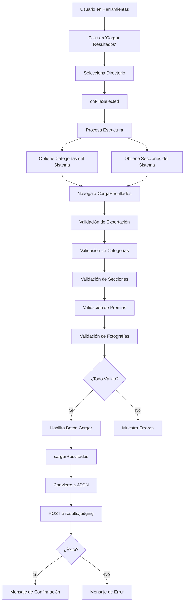

# 📊 Proceso de Importación de Resultados de Concursos

## 📋 Índice
1. [Resumen General](#resumen-general)
2. [Flujo del Proceso](#flujo-del-proceso)
3. [Estructura de Directorios Requerida](#estructura-de-directorios-requerida)
4. [Componentes Involucrados](#componentes-involucrados)
5. [Validaciones](#validaciones)
6. [Endpoint de Backend](#endpoint-de-backend)
7. [Casos de Uso](#casos-de-uso)
8. [Problemas Conocidos](#problemas-conocidos)
9. [Mejoras Propuestas](#mejoras-propuestas)

---

## 🎯 Resumen General

El sistema de importación de resultados permite cargar de forma masiva los resultados de un concurso fotográfico a partir de una **estructura de directorios** organizada jerárquicamente. El usuario selecciona una carpeta desde el navegador que contiene las fotografías organizadas por categoría, sección y premio, y el sistema valida y carga estos resultados automáticamente.

### Características Principales
- ✅ Carga masiva de resultados mediante estructura de directorios
- ✅ Validación automática de categorías, secciones y premios
- ✅ Detección de fotografías sin catalogar
- ✅ Feedback visual del proceso de validación
- ✅ Normalización de nombres (elimina acentos y capitalización)

---

## 🔄 Flujo del Proceso



### Paso a Paso

#### 1. **Inicio del Proceso** (`herramientas.page.ts`)
El usuario hace clic en el botón "Cargar Resultados" que abre un selector de directorio:

```typescript
// Template HTML
<input #fileInput type="file" webkitdirectory directory multiple 
       (change)="onFileSelected($event)" style="display: none;" />
<ion-button expand="block" color="secondary" (click)="fileInput.click()">
  Cargar Resultados
</ion-button>
```

#### 2. **Procesamiento de Archivos** (`onFileSelected`)
```typescript
async onFileSelected(event: any) {
  const files: FileList = event.target.files;
  
  // 1. Construir estructura de texto
  let estructura = '';
  Array.from(files).forEach(file => {
    const relativePath = (file as any).webkitRelativePath || file.name;
    estructura += '      ' + relativePath + '\n';
  });
  
  // 2. Extraer y marcar directorios
  const directorios = new Set<string>();
  Array.from(files).forEach(file => {
    const relativePath = (file as any).webkitRelativePath || file.name;
    const partes = relativePath.split('/');
    for (let i = 1; i < partes.length; i++) {
      const dir = partes.slice(0, i).join('/');
      directorios.add(dir);
    }
  });
  directorios.forEach(dir => {
    estructura = '[DIR] ' + dir + '\n' + estructura;
  });
  
  // 3. Obtener datos del sistema
  let categorias: Category[] = await this.categoryService.getAll<Category>().toPromise();
  let secciones: Section[] = await this.sectionService.getAll<Section>().toPromise();
  
  // 4. Navegar a página de validación
  this.router.navigate(['/herramientas/carga-resultados'], 
    { state: { estructura, categorias, secciones } });
}
```

#### 3. **Validación** (`carga-resultados.page.ts`)

El componente `CargaResultadosPage` recibe la estructura y realiza múltiples validaciones:

##### a) Validación de Directorio Principal
```typescript
private validarDirectorioExportacion(estructura: string): boolean {
  const lineas = estructura.split('\n').map(l => l.trim());
  return lineas.some(l => l === '[DIR] exportacion/' || l === '[DIR] exportacion');
}
```

##### b) Validación de Categorías (Nivel 2)
```typescript
private validarCategorias(estructura: string, categorias: Category[]) {
  // Busca subdirectorios bajo exportacion/
  const subdirs = lineas.filter(l => {
    if (!l.startsWith('[DIR] exportacion/')) return false;
    const resto = l.replace('[DIR] exportacion/', '');
    return resto.length > 0 && !resto.slice(0, -1).includes('/');
  });
  
  // Valida cada categoría contra el sistema
  this.validacionesCategorias = subdirs.map(dir => {
    const categoria = categorias.find(cat => {
      const catNormalizada = normalizarNombre(cat.name);
      const dirNormalizada = normalizarNombre(nombreDir);
      return catNormalizada === dirNormalizada;
    });
    
    return categoria 
      ? { dir: nombreDir, mensaje: `Categoría reconocida: ${categoria.name}`, color: 'success' }
      : { dir: nombreDir, mensaje: `Categoría desconocida: ${nombreDir}`, color: 'warning' };
  });
}
```

##### c) Validación de Secciones (Nivel 3)
```typescript
private validarSecciones(estructura: string, secciones: Section[]) {
  // Busca directorios con formato: exportacion/categoria/seccion/
  const subdirs = lineas.filter(l => {
    if (!l.startsWith('[DIR] exportacion/')) return false;
    const resto = l.replace('[DIR] exportacion/', '');
    const segmentos = resto.split('/');
    return segmentos.length === 3 && segmentos[1].length > 0;
  });
  
  this.validacionesSecciones = subdirs.map(dir => {
    const segmentos = nombreDir.split('/');
    const nombreSeccion = segmentos[1];
    
    const seccion = secciones.find(sec => {
      return normalizarNombre(sec.name) === normalizarNombre(nombreSeccion);
    });
    
    return seccion
      ? { dir: nombreDir, mensaje: `Sección reconocida: ${seccion.name}`, color: 'success' }
      : { dir: nombreDir, mensaje: `Sección desconocida: ${nombreSeccion}`, color: 'warning' };
  });
}
```

##### d) Validación de Premios (Nivel 4)
```typescript
private validarCuartoNivel(estructura: string) {
  const premiosValidos = [
    '1er PREMIO', '2do PREMIO', '3er PREMIO',
    'MENCION ESPECIAL', 'MENCION HONORIFICA',
    'RECHAZADA', 'FUERA DE REGLAMENTO',
    'PRIMER PREMIO', 'SEGUNDO PREMIO', 'TERCER PREMIO',
    'ACEPTADA', 'MENCION JURADO'
  ];
  
  // Busca directorios de premios (nivel 4)
  const elementosTercerNivel = lineas.filter(l => {
    const resto = l.replace('[DIR] exportacion/', '');
    const segmentos = resto.split('/');
    return segmentos.length === 3 && segmentos[2].length > 0;
  });
  
  // También detecta fotografías sin catalogar
  const archivosTercerNivel = archivos.filter(l => {
    const resto = l.replace('      exportacion/', '');
    const segmentos = resto.split('/');
    return segmentos.length === 3;
  });
  
  archivosTercerNivel.forEach((elemento) => {
    this.fotografiasSinCatalogar.push(rutaCompleta);
  });
}
```

##### e) Función de Normalización
```typescript
function normalizarNombre(nombre: string): string {
  return nombre
    .normalize('NFD')
    .replace(/[\u0300-\u036f]/g, '') // Quitar diacríticos (acentos)
    .toLowerCase()
    .trim();
}
```

#### 4. **Habilitación del Botón de Carga**
```typescript
canCargarResultados(): boolean {
  if (!this.exportacionValida) return false;
  
  const todasCategoriasOk = this.validacionesCategorias.every(v => v.color === 'success');
  const todasSeccionesOk = this.validacionesSecciones.every(v => v.color === 'success');
  const todosPremiosOk = this.validacionesPremios.every(v => v.color === 'success');
  
  if (this.fotografiasSinCatalogar.length > 0) return false;
  
  const todasFotografiasOk = this.validacionesFotografias.every(
    v => v.color === 'success' || v.color === 'medium'
  );
  
  return todasCategoriasOk && todasSeccionesOk && todosPremiosOk && todasFotografiasOk;
}
```

#### 5. **Envío de Resultados**
```typescript
async cargarResultados() {
  const estructuraJson = this.estructuraToJson();
  
  const token = localStorage.getItem(this.config.tokenKey);
  const headers = token ? { Authorization: 'Bearer ' + token } : {};
  
  const response = await this.http.post(
    this.config.publicApiUrl('results/judging'),
    { estructura: estructuraJson },
    { headers }
  ).toPromise();
  
  alert('Resultados cargados correctamente.');
}
```

---

## 📁 Estructura de Directorios Requerida

### Jerarquía de 5 Niveles

```
exportacion/                          ← Nivel 1: Directorio raíz
├── Estimulo/                         ← Nivel 2: Categoría
│   ├── Color/                        ← Nivel 3: Sección
│   │   ├── 1er PREMIO/              ← Nivel 4: Premio
│   │   │   ├── foto1.jpg            ← Nivel 5: Fotografías
│   │   │   └── foto2.jpg
│   │   ├── 2do PREMIO/
│   │   │   └── foto3.jpg
│   │   └── MENCION ESPECIAL/
│   │       └── foto4.jpg
│   └── Blanco y Negro/
│       ├── 1er PREMIO/
│       │   └── foto5.jpg
│       └── ACEPTADA/
│           └── foto6.jpg
└── Libre/
    └── Color/
        └── 1er PREMIO/
            └── foto7.jpg
```

### Premios Válidos

El sistema reconoce los siguientes premios:

| Premio Español | Descripción |
|----------------|-------------|
| `1er PREMIO` | Primer premio |
| `2do PREMIO` | Segundo premio |
| `3er PREMIO` | Tercer premio |
| `PRIMER PREMIO` | Alternativa para 1er premio |
| `SEGUNDO PREMIO` | Alternativa para 2do premio |
| `TERCER PREMIO` | Alternativa para 3er premio |
| `MENCION ESPECIAL` | Mención especial del jurado |
| `MENCION HONORIFICA` | Mención honorífica |
| `MENCION JURADO` | Mención del jurado |
| `ACEPTADA` | Fotografía aceptada |
| `RECHAZADA` | Fotografía rechazada |
| `FUERA DE REGLAMENTO` | No cumple reglamento |

### Ejemplo Real

```
exportacion/
├── Estimulo/              ✅ Categoría válida
│   ├── Color/             ✅ Sección válida
│   │   ├── 1er PREMIO/    ✅ Premio válido
│   │   │   ├── IMG_001.jpg
│   │   │   └── IMG_002.jpg
│   │   ├── foto_suelta.jpg  ⚠️ ERROR: Fotografía sin catalogar (nivel 3)
│   └── Blanco y Negro/
│       └── PRIMER PREMIO/
├── Categoria_Nueva/       ⚠️ WARNING: Categoría desconocida
└── archivo.txt           ⚠️ ERROR: Archivo en nivel 1 (debe estar en nivel 5)
```

---

## 🧩 Componentes Involucrados

### 1. `HerramientasPage`
**Archivo**: `src/app/herramientas/herramientas.page.ts`

**Responsabilidad**: Punto de entrada para la funcionalidad de carga de resultados.

**Métodos Clave**:
```typescript
async onFileSelected(event: any): Promise<void>
```
- Procesa la selección de directorio
- Construye la estructura de texto
- Obtiene categorías y secciones del sistema
- Navega a la página de validación

### 2. `CargaResultadosPage`
**Archivo**: `src/app/herramientas/carga-resultados/carga-resultados.page.ts`

**Responsabilidad**: Validación y carga de resultados.

**Métodos Clave**:
```typescript
// Validaciones
private validarDirectorioExportacion(estructura: string): boolean
private validarCategorias(estructura: string, categorias: Category[]): void
private validarSecciones(estructura: string, secciones: Section[]): void
private validarCuartoNivel(estructura: string): void
private validarQuintoNivel(estructura: string): void

// Utilidades
obtenerNombreArchivo(ruta: string): string
estructuraToJson(): any
canCargarResultados(): boolean

// Acción principal
async cargarResultados(): Promise<void>
```

### 3. `CargaResultadosModalComponent`
**Archivo**: `src/app/herramientas/carga-resultados-modal/carga-resultados-modal.component.ts`

**Responsabilidad**: Mostrar la estructura en un modal (componente legacy, actualmente no se usa).

### 4. Servicios Relacionados

#### `ContestService`
```typescript
// No tiene método específico de carga de resultados en Angular
// El método uploadResults existe en Vue (test_vue)
```

#### `CategoryService`
```typescript
getAll<Category>(): Observable<Category[]>
```

#### `SectionService`
```typescript
getAll<Section>(): Observable<Section[]>
```

#### `ContestResultService`
```typescript
// Servicio base para gestión de resultados individuales
post(result: ContestResult): Observable<ContestResult>
```

---

## ✅ Validaciones

### 1. Validación de Estructura Base
```typescript
✅ Debe existir directorio 'exportacion'
✅ Debe estar en el primer nivel
```

### 2. Validación de Categorías (Nivel 2)
```typescript
✅ Los nombres de directorios deben coincidir con categorías del sistema
✅ Se ignoran acentos y mayúsculas (normalización)
⚠️ Las categorías desconocidas generan advertencia
```

**Ejemplos**:
- `Estimulo` ✅ → reconoce `Estímulo`
- `LIBRE` ✅ → reconoce `Libre`
- `categoria_falsa` ⚠️ → categoría desconocida

### 3. Validación de Secciones (Nivel 3)
```typescript
✅ Los nombres de directorios deben coincidir con secciones del sistema
✅ Se ignoran acentos y mayúsculas (normalización)
⚠️ Las secciones desconocidas generan advertencia
```

**Ejemplos**:
- `Color` ✅
- `Blanco y Negro` ✅
- `blanco_y_negro` ✅ (si existe como "Blanco y Negro")

### 4. Validación de Premios (Nivel 4)
```typescript
✅ Los nombres deben estar en la lista de premios válidos
⚠️ Los premios desconocidos generan advertencia
⚠️ Las fotografías en nivel 3 se marcan como "sin catalogar"
```

### 5. Validación de Fotografías (Nivel 5)
```typescript
✅ Las fotografías deben estar en el nivel 5 (dentro de un premio)
❌ Las fotografías en otros niveles impiden la carga
```

### Resultado de Validaciones

```typescript
// Todas las validaciones pasan → Botón habilitado
canCargarResultados() === true

// Alguna validación falla → Botón deshabilitado
canCargarResultados() === false
```

---

## 🌐 Endpoint de Backend

### POST `/results/judging`

**URL Completa**: `{publicApiUrl}/results/judging`

**Headers**:
```json
{
  "Authorization": "Bearer {token}",
  "Content-Type": "application/json"
}
```

**Body**:
```json
{
  "estructura": {
    "exportacion": {
      "Estimulo": {
        "Color": {
          "1er PREMIO": {
            "__files": ["foto1.jpg", "foto2.jpg"]
          },
          "2do PREMIO": {
            "__files": ["foto3.jpg"]
          }
        },
        "Blanco y Negro": {
          "ACEPTADA": {
            "__files": ["foto4.jpg"]
          }
        }
      }
    }
  }
}
```

**Respuesta Exitosa**:
```json
{
  "success": true,
  "message": "Resultados importados correctamente"
}
```

**Respuesta de Error**:
```json
{
  "success": false,
  "message": "Error al importar resultados: {detalle}"
}
```

### Conversión de Estructura

La función `estructuraToJson()` convierte el texto plano a JSON anidado:

```typescript
estructuraToJson(): any {
  const lines = this.estructura.split('\n').map(l => l.trim()).filter(l => l.length > 0);
  const root: any = {};
  
  lines.forEach(line => {
    let path = line.replace('[DIR] ', '');
    const isDir = line.startsWith('[DIR]');
    const parts = path.split('/').filter(p => p.length > 0);
    let current = root;
    
    for (let i = 0; i < parts.length; i++) {
      const part = parts[i];
      if (i === parts.length - 1) {
        if (isDir) {
          if (!current[part]) current[part] = {};
        } else {
          if (!current['__files']) current['__files'] = [];
          current['__files'].push(part);
        }
      } else {
        if (!current[part]) current[part] = {};
        current = current[part];
      }
    }
  });
  
  return root;
}
```

---

## 📚 Casos de Uso

### Caso 1: Importación Exitosa

**Escenario**: Usuario tiene estructura correcta con todas las categorías y secciones válidas.

**Pasos**:
1. Usuario navega a `/herramientas`
2. Click en "Cargar Resultados"
3. Selecciona directorio `exportacion/` con estructura válida
4. Sistema muestra validaciones en verde ✅
5. Botón "Cargar Resultados" está habilitado
6. Click en botón
7. Sistema muestra loading
8. Mensaje de confirmación

**Resultado**: Resultados cargados correctamente en el sistema.

---

### Caso 2: Categoría Desconocida

**Escenario**: Usuario tiene una categoría que no existe en el sistema.

**Pasos**:
1. Usuario selecciona directorio con categoría `Nueva_Categoria/`
2. Sistema muestra validación en amarillo ⚠️: "Categoría desconocida: Nueva_Categoria"
3. Botón "Cargar Resultados" está deshabilitado

**Resultado**: Usuario debe corregir el nombre de la categoría o agregarla al sistema.

---

### Caso 3: Fotografías Sin Catalogar

**Escenario**: Hay fotografías sueltas en nivel 3 (fuera de premios).

**Estructura**:
```
exportacion/
└── Estimulo/
    └── Color/
        ├── foto_suelta.jpg     ⚠️ Problema
        └── 1er PREMIO/
            └── foto_ok.jpg      ✅ OK
```

**Resultado**:
- Sistema muestra: "⚠️ Se encontraron X fotografías sin catalogar"
- Lista las fotografías: `foto_suelta.jpg`
- Botón deshabilitado hasta mover las fotos a un premio

---

### Caso 4: Mapeo Especial de Nombres

**Escenario**: Directorio se llama "Estmulo" (sin acento) y la categoría del sistema es "Estímulo".

**Sistema**:
```typescript
const mapeosEspeciales: {[key: string]: string} = {
  'estmulo': 'estimulo',
  'estimulo': 'estimulo',
  'estímulo': 'estimulo'
};
```

**Resultado**: El sistema reconoce "Estmulo" como "Estímulo" ✅

---

## ⚠️ Problemas Conocidos

### 1. **Limitación del Navegador con `webkitdirectory`**

**Problema**: El atributo `webkitdirectory` no está estandarizado y puede comportarse diferente en distintos navegadores.

**Navegadores Afectados**:
- ✅ Chrome/Edge: Funciona correctamente
- ⚠️ Firefox: Puede tener limitaciones
- ❌ Safari: Soporte limitado
- ❌ IE: No soportado

**Solución Temporal**: Documentar que la funcionalidad requiere Chrome o Edge.

---

### 2. **No Se Validan Extensiones de Archivo**

**Problema**: El sistema acepta cualquier tipo de archivo sin validar si son imágenes.

**Impacto**: Podría cargarse archivos `.txt`, `.pdf`, etc.

**Mejora Propuesta**:
```typescript
const extensionesValidas = ['.jpg', '.jpeg', '.png', '.gif', '.webp'];

const esImagenValida = (filename: string): boolean => {
  return extensionesValidas.some(ext => filename.toLowerCase().endsWith(ext));
};
```

---

### 3. **No Hay Asociación con Concurso**

**Problema**: El endpoint `/results/judging` recibe la estructura pero no se especifica para qué concurso es.

**Impacto**: No queda claro cómo el backend asocia los resultados con un concurso específico.

**Solución Propuesta**:
```typescript
// Modificar el envío para incluir contest_id
const response = await this.http.post(
  this.config.publicApiUrl('results/judging'),
  { 
    contest_id: this.concursoSeleccionado.id,  // ← Agregar
    estructura: estructuraJson 
  },
  { headers }
).toPromise();
```

---

### 4. **Mapeo Especial Hardcodeado**

**Problema**: Los mapeos especiales están hardcodeados en el componente.

**Código Actual**:
```typescript
const mapeosEspeciales: {[key: string]: string} = {
  'estmulo': 'estimulo',
  'estimulo': 'estimulo',
  'estímulo': 'estimulo'
};
```

**Mejora Propuesta**: Mover a configuración o servicio.

---

### 5. **Falta Manejo de Duplicados**

**Problema**: No se valida si una fotografía ya existe en el sistema antes de importarla.

**Impacto**: Podría generar resultados duplicados.

**Solución Propuesta**: Validar en backend por nombre de archivo o hash.

---

### 6. **No Se Muestra Progreso de Carga**

**Problema**: Solo hay un loading genérico, no se ve cuántas fotos se están procesando.

**Mejora Propuesta**:
```typescript
// Usar un progress bar
const totalFotos = contarFotografias(estructuraJson);
let fotosProcessed = 0;

// Actualizar cada N fotos
loading.message = `Procesando ${fotosProcessed}/${totalFotos} fotografías...`;
```

---

### 7. **Error en Normalización de "Estímulo"**

**Problema Detectado**: El log muestra que la normalización de "Estímulo" puede fallar.

**Log del Código**:
```typescript
if (cat.name.toLowerCase().includes('estímulo')) {
  console.log('🔧 DEBUG NORMALIZACIÓN:');
  console.log('  - Original:', cat.name);
  console.log('  - NFD:', cat.name.normalize('NFD'));
  console.log('  - Sin diacríticos:', cat.name.normalize('NFD').replace(/[\u0300-\u036f]/g, ''));
}
```

**Solución Implementada**: Mapeo especial para "estmulo" → "estimulo"

---

## 🚀 Mejoras Propuestas

### 1. **Agregar Selección de Concurso**

**Propuesta**: Antes de cargar resultados, seleccionar el concurso al que pertenecen.

**Implementación**:
```typescript
// En herramientas.page.html
<ion-item>
  <ion-label>Concurso</ion-label>
  <ion-select [(ngModel)]="concursoSeleccionado">
    <ion-select-option *ngFor="let c of concursos" [value]="c">
      {{c.name}}
    </ion-select-option>
  </ion-select>
</ion-item>

// En carga-resultados.page.ts
async cargarResultados() {
  const response = await this.http.post(
    this.config.publicApiUrl('results/judging'),
    { 
      contest_id: this.concurso.id,  // ← Agregar
      estructura: estructuraJson 
    },
    { headers }
  ).toPromise();
}
```

---

### 2. **Validación de Extensiones de Archivo**

```typescript
const EXTENSIONES_VALIDAS = ['.jpg', '.jpeg', '.png', '.gif', '.webp', '.tiff', '.bmp'];

private validarExtensionesArchivos(estructura: string): void {
  const archivos = estructura.split('\n')
    .filter(l => !l.startsWith('[DIR]') && l.trim().length > 0);
  
  this.validacionesArchivos = archivos.map(archivo => {
    const ext = archivo.substring(archivo.lastIndexOf('.')).toLowerCase();
    const esValido = EXTENSIONES_VALIDAS.includes(ext);
    
    return {
      archivo,
      mensaje: esValido 
        ? `Formato válido: ${ext}` 
        : `Formato no permitido: ${ext}`,
      color: esValido ? 'success' : 'danger'
    };
  }).filter(v => v.color === 'danger'); // Solo mostrar errores
}
```

---

### 3. **Mapeos Configurables**

```typescript
// src/app/config/mappings.config.ts
export const MAPEOS_ESPECIALES = {
  categorias: {
    'estmulo': 'estimulo',
    'libre': 'libre',
    // Agregar más según necesidad
  },
  secciones: {
    'color': 'color',
    'bn': 'blanco y negro',
    'byn': 'blanco y negro'
  }
};

// En el componente
import { MAPEOS_ESPECIALES } from 'src/app/config/mappings.config';

const mapeoEspecial = MAPEOS_ESPECIALES.categorias[dirNormalizada];
```

---

### 4. **Vista Previa Antes de Cargar**

```typescript
// Agregar método de preview
async previsualizarResultados() {
  const estructuraJson = this.estructuraToJson();
  const preview = this.generarPreview(estructuraJson);
  
  const alert = await this.alertController.create({
    header: 'Confirmación',
    message: `Se cargarán ${preview.totalFotos} fotografías en ${preview.totalCategorias} categorías.`,
    buttons: [
      { text: 'Cancelar', role: 'cancel' },
      { text: 'Confirmar', handler: () => this.cargarResultados() }
    ]
  });
  
  await alert.present();
}

private generarPreview(estructura: any): any {
  let totalFotos = 0;
  let totalCategorias = 0;
  
  // Contar recursivamente
  const contar = (obj: any) => {
    for (const key in obj) {
      if (key === '__files') {
        totalFotos += obj[key].length;
      } else {
        totalCategorias++;
        contar(obj[key]);
      }
    }
  };
  
  contar(estructura.exportacion);
  
  return { totalFotos, totalCategorias };
}
```

---

### 5. **Logging Mejorado**

```typescript
// Servicio de logging estructurado
@Injectable({ providedIn: 'root' })
export class ImportLoggerService {
  private logs: string[] = [];
  
  log(message: string, level: 'info' | 'warn' | 'error' = 'info') {
    const timestamp = new Date().toISOString();
    const logEntry = `[${timestamp}] [${level.toUpperCase()}] ${message}`;
    this.logs.push(logEntry);
    console.log(logEntry);
  }
  
  getLogs(): string[] {
    return this.logs;
  }
  
  exportLogs(): Blob {
    const content = this.logs.join('\n');
    return new Blob([content], { type: 'text/plain' });
  }
}
```

---

### 6. **Rollback en Caso de Error**

```typescript
async cargarResultados() {
  const estructuraJson = this.estructuraToJson();
  const loading = await this.loadingController.create({
    message: 'Enviando resultados...'
  });
  await loading.present();
  
  try {
    const response = await this.http.post(
      this.config.publicApiUrl('results/judging'),
      { 
        estructura: estructuraJson,
        rollback_on_error: true  // ← Solicitar rollback al backend
      },
      { headers }
    ).toPromise();
    
    await loading.dismiss();
    alert('Resultados cargados correctamente.');
  } catch (error) {
    await loading.dismiss();
    
    // Ofrecer opción de reintentar
    const alert = await this.alertController.create({
      header: 'Error',
      message: 'Error al cargar resultados. ¿Desea reintentar?',
      buttons: [
        { text: 'Cancelar', role: 'cancel' },
        { text: 'Reintentar', handler: () => this.cargarResultados() }
      ]
    });
    
    await alert.present();
  }
}
```

---

### 7. **Soporte para Dry Run**

```typescript
// Agregar botón de prueba
<ion-button expand="block" color="medium" 
            [disabled]="!canCargarResultados()" 
            (click)="simularCarga()">
  Simular Carga (Dry Run)
</ion-button>

async simularCarga() {
  const estructuraJson = this.estructuraToJson();
  
  const response = await this.http.post(
    this.config.publicApiUrl('results/judging'),
    { 
      estructura: estructuraJson,
      dry_run: true  // ← No guardar, solo validar
    },
    { headers }
  ).toPromise();
  
  // Mostrar reporte de lo que se haría
  alert(`Dry Run:\n- ${response.fotosTotal} fotografías\n- ${response.errores.length} errores`);
}
```

---

## 📝 Resumen de Archivos Clave

| Archivo | Ruta | Responsabilidad |
|---------|------|-----------------|
| `herramientas.page.ts` | `src/app/herramientas/` | Inicio del proceso, selección de directorio |
| `herramientas.page.html` | `src/app/herramientas/` | UI para seleccionar directorio |
| `carga-resultados.page.ts` | `src/app/herramientas/carga-resultados/` | Validación y carga de resultados |
| `carga-resultados.page.html` | `src/app/herramientas/carga-resultados/` | Vista de validaciones y botón de carga |
| `carga-resultados-modal.component.ts` | `src/app/herramientas/carga-resultados-modal/` | Modal (legacy, no usado) |
| `contest.service.ts` | `src/app/services/` | Servicios de concursos |
| `category.service.ts` | `src/app/services/` | Servicios de categorías |
| `section.service.ts` | `src/app/services/` | Servicios de secciones |
| `contest-result.service.ts` | `src/app/services/` | Servicios de resultados individuales |

---

## 🔗 Referencias

- [Documentación de Servicios](./servicios.md)
- [Documentación de Componentes](./componentes.md)
- [Arquitectura del Sistema](./arquitectura.md)
- [Especificación Universal](./especificacion-universal.md)

---

## 📅 Historial de Cambios

| Fecha | Versión | Cambios |
|-------|---------|---------|
| 2025-10-28 | 1.0 | Documentación inicial del proceso de importación |

---

**Autor**: GitHub Copilot  
**Última Actualización**: 28 de octubre de 2025
